# 🎓 Project 69 – LearnSphere – Premium LMS | Spring Boot + H2 + Bypass Full Stack

<p align="left">


</p>

## 📖 Project Overview

LearnSphere is Project 69 of Tier 7 – Full Stack Integration, built with Spring Boot 3.2.5, H2 Database, Spring Data JPA, Hibernate, Spring Security (Bypass Mode – permitAll) and Single File Premium Frontend served from `src/main/resources/static/`.

This project uses BYPASS FULL STACK architecture:

- Frontend and Backend run on SAME port 9292 – http://localhost:9292/
- No CORS issues, No separate React build – Single static/index.html with Vanilla JS
- Backend serves frontend directly – Deploy as 1 JAR
- Auth with STUDENT / INSTRUCTOR role selector + Simple Base64 Token + BCrypt
- Login required to Enroll – Role based UI – My Learning Drawer + Progress

Backend provides REST endpoints:

- POST /api/auth/register – Register STUDENT/INSTRUCTOR
- POST /api/auth/login – Login
- GET /api/users/by-email?email= – Get user by email for enrollment FK
- GET /api/courses – List all courses live
- POST /api/courses – Add new course (INSTRUCTOR UI)
- DELETE /api/courses/{id} – Delete course (INSTRUCTOR)
- POST /api/enrollments – Enroll a course (STUDENT)
- GET /api/enrollments – All enrollments JSON
- GET /api/enrollments/my/{email} – My Learning feature

Frontend displays:

- LearnSphere header with gradient logo • Learn without limits hero
- Login / Create Account – Glassmorphism auth card – Role selector STUDENT / INSTRUCTOR
- Search bar + Filters All / Java / Frontend / DevOps / AI
- Premium course cards: image, ₹2999 badge, level badge Advanced/Beginner/Intermediate, title, instructor, category, duration, description, Preview + Enroll Now
- INSTRUCTOR Dashboard – + Add Course violet gradient button – Modal with 8 fields – Add Course to LMS
- STUDENT Dashboard – Enroll Now with green toast Enrolled successfully! – My Learning (1) counter
- My Learning drawer – PROGRESS • Courses • Avg % – Progress bar – Enrolled course card with ENROLLED • 15% + bar
- Role protection – INSTRUCTOR can't enroll – Only STUDENT can enroll toast
- API verification pages – /api/courses and /api/enrollments JSON

## ✨ Features

### 🔐 Authentication – Bypass Simple

- Register with Full Name, Email, Password, Role (STUDENT / INSTRUCTOR) – BCrypt hashed in H2
- Login returns simple Base64 token email:role:timestamp
- Token + role + email stored in localStorage – Auto login on refresh
- On H2 mem restart data is wiped – Need to re-register – Can switch to file H2 for persistence

### 📚 Courses Feed – Real App

- Fetches all courses from H2 via /api/courses
- Premium cards: image, ₹ price badge top-right black, level white pill top-left, title Outfit font, meta instructor • category • duration, description, Preview + Enroll Now dark button
- 3 sample courses auto-added on start via DataLoader – Java Full Stack 2999 Advanced, React 18 1999 Beginner, AWS DevOps 3999 Intermediate
- Filters – All, Java, Frontend, DevOps – Active black pill
- Search – title + category contains – Live filter
- Responsive grid – 3 columns desktop, 1 column mobile
- Status badge – ● 3 courses live green

### ➕ Instructor Dashboard – Add New Course

- Violet gradient + Add Course button – Top right – INSTRUCTOR only – STUDENT hidden
- Modal – Add New Course - Instructor Only – 8 inputs: Title *, Category * (Java, Frontend, DevOps, AI), Instructor Name, Price INR *, Duration, Level (Beginner, Intermediate, Advanced), Description *, Image URL (Unsplash link)
- Add Course to LMS button – Black – Green toast Course added! – Grid grows instantly
- Tested 3 to 5 courses – Python 3499 Beginner, Google Cloud 3499 Beginner – Proves scalability
- ImageUrl column length 2000 – Supports long Unsplash / gstatic URLs – Fix for base64 fail

### 🎒 My Learning – Main Feature

- Top-right My Learning (1) button – Beside All Courses, Java, Frontend, DevOps and Logout
- Drawer slide from right with Close – Fetches via /api/enrollments/my/{email}
- Uses custom query EnrollmentRepository.findByUser_Email(email)
- Progress card – PROGRESS – Courses • Avg % – Gradient bar – Black card
- Each enrollment: thumbnail 46px, title, category • enrolledAt, ENROLLED • 15%, progress bar gradient
- Empty state – 📚 No enrollments yet
- Enrollment creation links user FK – Uses /api/users/by-email?email= to get user id before POST – Progress 15% default – status ENROLLED

### 🛡️ Role Protection

- INSTRUCTOR sees + Add Course – Can add courses – Cannot enroll – Shows toast Only STUDENT can enroll. Logout & login as Student
- STUDENT sees Enroll Now – Can enroll – Toast Enrolled successfully! – Can open My Learning – Counter increments My Learning (1) -> (2)

## 🛠 Technologies Used

| Technology | Version | Purpose |
|---|---|---|
| Java | 21.0.10 | Backend language |
| Spring Boot | 3.2.5 | REST APIs, Embedded Tomcat |
| Spring Data JPA / Hibernate | 6.4.4.Final | ORM – User, Course, Enrollment |
| Spring Security | 6.2.4 | Bypass – permitAll() – No JWT filter |
| H2 Database | 2.2.x | In-memory / file DB – No setup – h2-console enabled |
| PasswordEncoder | BCrypt | Password hashing |
| Frontend | Single static/index.html – Vanilla JS | No React build – Bypass full stack |
| CSS | Pure CSS – Outfit + Inter fonts – Gradient #7C3AED -> #06B6D4 + Dark #0F0F13 | Real App Premium |
| Maven | 3.9+ | Build |

## 📂 Project Structure

```text
69-lms-mini/
│
├── src/main/java/com/lms/
│   ├── Application.java – SpringBoot main + DataLoader Sample courses added!
│   ├── config/
│   │   ├── SecurityConfig.java – Bypass permitAll + BCrypt PasswordEncoder
│   │   └── DataLoader.java – 3 courses auto-add if count==0 – Java, React, AWS
│   ├── security/
│   │   └── JwtUtil.java – Simple Base64 token – No external JJWT lib
│   ├── controller/
│   │   ├── AuthController.java – /api/auth/register, /api/auth/login
│   │   ├── CourseController.java – /api/courses GET, POST, DELETE
│   │   ├── EnrollmentController.java – /api/enrollments POST, GET, /my/{email} GET
│   │   └── UserController.java – /api/users/by-email?email= – For enrollment FK mapping
│   ├── entity/
│   │   ├── User.java – id, name, email(unique), password, role STUDENT/INSTRUCTOR
│   │   ├── Course.java – id, title, description length 1000, instructor, category, price, duration, imageUrl length 2000, level
│   │   └── Enrollment.java – id, enrolledAt LocalDate now, status ENROLLED, progress 15, ManyToOne User, ManyToOne Course
│   ├── repository/
│   │   ├── UserRepository.java – findByEmail(String email)
│   │   ├── CourseRepository.java
│   │   └── EnrollmentRepository.java – findByUser_Email(String email) – My Learning query
│
├── src/main/resources/
│   ├── static/
│   │   └── index.html – Full Real App in ONE file – Auth + Filters + Search + Enroll + My Learning Drawer + Add Course Modal + Toasts
│   └── application.properties – port 9292, H2 mem/file, ddl-auto create, h2-console, show-sql
│
├── screenshots/ – 14 premium images
│   ├── demo1.png
│   ├── demo2.png
│   ├── demo3.png
│   ├── demo4.png
│   ├── demo5.png
│   ├── demo6.png
│   ├── demo7.png
│   ├── demo8.png
│   ├── demo9.png
│   ├── demo10.png
│   ├── demo11.png
│   ├── demo12.png
│   ├── demo13.png
│   └── demo14.png
│
├── pom.xml – spring-boot-starter-web, data-jpa, security, H2
├── .gitignore – target/, data/, .idea/, *.db
└── README.md
```

## ▶ How to Run

### 1. Clone

```bash
git clone https://github.com/raviteja-dev950/69-lms-mini.git
cd 69-lms-mini
```

### 2. Application Properties

Current (in-memory – wipes on restart):

```properties
server.port=9292
spring.datasource.url=jdbc:h2:mem:lmsdb
spring.datasource.driver-class-name=org.h2.Driver
spring.datasource.username=sa
spring.datasource.password=
spring.jpa.hibernate.ddl-auto=create
spring.jpa.show-sql=false
spring.h2.console.enabled=true
spring.h2.console.path=/h2-console
```

For persistence (recommended for demo):

```properties
spring.jpa.hibernate.ddl-auto=update
spring.datasource.url=jdbc:h2:file:./data/lmsdb
```

### 3. Run – Single Command

```bash
mvn clean install -DskipTests
mvn spring-boot:run
```

Open:

- http://localhost:9292/ – Frontend + Backend Same Port – LearnSphere
- http://localhost:9292/api/courses – Courses JSON – 3 to 5 courses
- http://localhost:9292/api/enrollments – Enrollments JSON
- http://localhost:9292/h2-console – H2 console – JDBC URL jdbc:h2:mem:lmsdb – User sa – No password

### 4. Frontend Logic (Inside index.html)

```javascript
// Register
fetch('/api/auth/register', {method:'POST', headers:{'Content-Type':'application/json'}, body: JSON.stringify({name,email,password,role})})

// Login
fetch('/api/auth/login', {method:'POST', body: JSON.stringify({email,password})})

// Load courses
fetch('/api/courses?nocache='+Date.now()).then(r=>r.json()).then(render)

// Add Course – Instructor Only – imageUrl must be short Unsplash, not base64
fetch('/api/courses', {method:'POST', body: JSON.stringify({title,category,instructor,price,duration,level,description,imageUrl})})

// Enroll – Get user id first for FK
let userRes = await fetch('/api/users/by-email?email='+localStorage.getItem("ls_user"));
let user = await userRes.json();
fetch('/api/enrollments', {method:'POST', body: JSON.stringify({user:{id: user.id}, course:{id: courseId})})

// My Learning
fetch('/api/enrollments/my/'+user.email)
```

## 🔄 Application Flow

```text
Browser
 │
 ▼
http://localhost:9292/ – static/index.html – REAL APP
 │
 ├── Auth Box – Login / Create Account – Role STUDENT / INSTRUCTOR – Full Name, Email, Password – Black button
 │   ├── POST /api/auth/register – BCrypt save – Return Base64 token – Save to localStorage ls_user
 │   └── POST /api/auth/login – findByEmail – BCrypt matches – Return token + role
 │
 ├── MainApp – if token exists – LearnSphere header – Search + All Courses / Java / Frontend / DevOps – My Learning (0) + email • Logout + Add Course (Instructor only)
 │   ├── Hero – Learn without limits – Master Java, React, DevOps – 4.9 RATED • 10K+ STUDENTS – ● 3 courses live
 │   ├── Filters – All (active black), Java, Frontend, DevOps – count – 3 courses found
 │   ├── Grid – /api/courses – Cards – Preview + Enroll Now – Enroll -> Toast Enrolled successfully!
 │   ├── STUDENT:
 │   │   ├── Enroll Now -> POST /api/enrollments – Toast Enrolled successfully! – My Learning counter (1)
 │   │   └── My Learning drawer – GET /api/enrollments/my/email – PROGRESS • 1 Courses • 15% Avg – ENROLLED • 15% bar
 │   └── INSTRUCTOR:
 │       ├── + Add Course violet gradient – Modal – 8 fields – Image URL must be Unsplash short, not base64/data:image – POST /api/courses – Course added! – Grid grows to 5
 │       └── Enroll click – Toast Only STUDENT can enroll. Logout & login as Student
 │
 └── Logout – localStorage.clear() – Back to Login
 │
 ▼
Spring Boot 9292 – Single JAR – permitAll
 │
 ▼
H2 – tables: users, course, enrollment – Sample courses added! on start – 3 to 5
```

## 🧪 API Testing

```bash
curl http://localhost:9292/api/courses

curl -X POST http://localhost:9292/api/auth/register -H "Content-Type: application/json" -d "{\"name\":\"Vemula Leela Venkata Ravi Teja\",\"email\":\"hero@gmail.com\",\"password\":\"1234\",\"role\":\"STUDENT\"}"

curl -X POST http://localhost:9292/api/auth/register -H "Content-Type: application/json" -d "{\"name\":\"Ravi Teja\",\"email\":\"instructor@gmail.com\",\"password\":\"1234\",\"role\":\"INSTRUCTOR\"}"

curl -X POST http://localhost:9292/api/auth/login -H "Content-Type: application/json" -d "{\"email\":\"hero@gmail.com\",\"password\":\"1234\"}"

curl "http://localhost:9292/api/users/by-email?email=hero@gmail.com"

curl -X POST http://localhost:9292/api/courses -H "Content-Type: application/json" -d "{\"title\":\"Python + AI Mastery\",\"category\":\"Java\",\"instructor\":\"Ravi Teja\",\"price\":3499.0,\"duration\":\"35 Hours\",\"level\":\"Beginner\",\"description\":\"Python for AI\",\"imageUrl\":\"https://images.unsplash.com/photo-1526379095098-d400fd0bf935\"}"

curl -X POST http://localhost:9292/api/enrollments -H "Content-Type: application/json" -d "{\"user\":{\"id\":2},\"course\":{\"id\":1}}"

curl http://localhost:9292/api/enrollments/my/hero@gmail.com

curl http://localhost:9292/api/enrollments
```

## 📡 API Endpoints

| Method | Endpoint | Access | Purpose |
|---|---|---|---|
| POST | `/api/auth/register` | Public | Create Account – STUDENT/INSTRUCTOR |
| POST | `/api/auth/login` | Public | Login |
| GET | `/api/users/by-email?email=` | Public | Get user id for enrollment FK |
| GET | `/api/courses` | Public | Courses live grid – Real App |
| POST | `/api/courses` | Public | INSTRUCTOR Add New Course – Modal |
| DELETE | `/api/courses/{id}` | Public | INSTRUCTOR Delete |
| POST | `/api/enrollments` | Public | STUDENT Enroll Now |
| GET | `/api/enrollments` | Public | All enrollments |
| GET | `/api/enrollments/my/{email}` | Public | My Learning drawer – Progress |

## 🗄 Database Note – H2

H2 uses GenerationType.IDENTITY – Auto increment – No sequence needed.

### Tables

```text
users – id, email UNIQUE, name, password BCrypt, role STUDENT/INSTRUCTOR

course – id, title, description length 1000, instructor, category, price, duration, image_url length 2000, level – Fix for long gstatic/base64

enrollment – id, enrolled_at LocalDate now, status ENROLLED, progress 15, user_id FK, course_id FK
```

DataLoader adds 3 courses on start if count==0 – Prints Sample courses added!

H2 Console: http://localhost:9292/h2-console – JDBC URL jdbc:h2:mem:lmsdb – User sa

Important: With mem + create, data wiped on restart – User not found after restart – Fix: Re-register or switch to file:./data/lmsdb + update.

### Verified

- /api/courses – 3 to 5 courses JSON – Java, React, AWS, Python, Google Cloud
- /api/enrollments – enrollments with nested course and user – progress 15

## 📸 Screenshots – LearnSphere Real App

### 1. STUDENT – Create Account – STUDENT

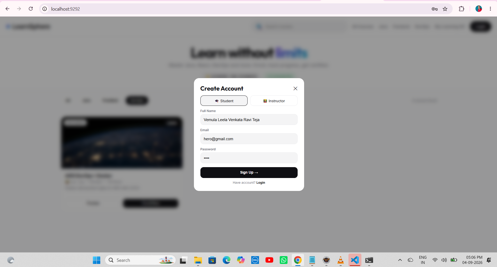

---

### 2. Customer Dashboard – LearnSphere – 3 Courses Live – hero • Logout

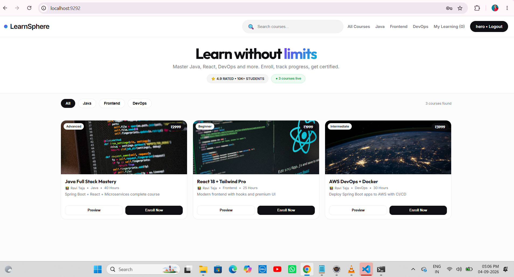

---

### 3. Enrolled Successfully – Green Toast

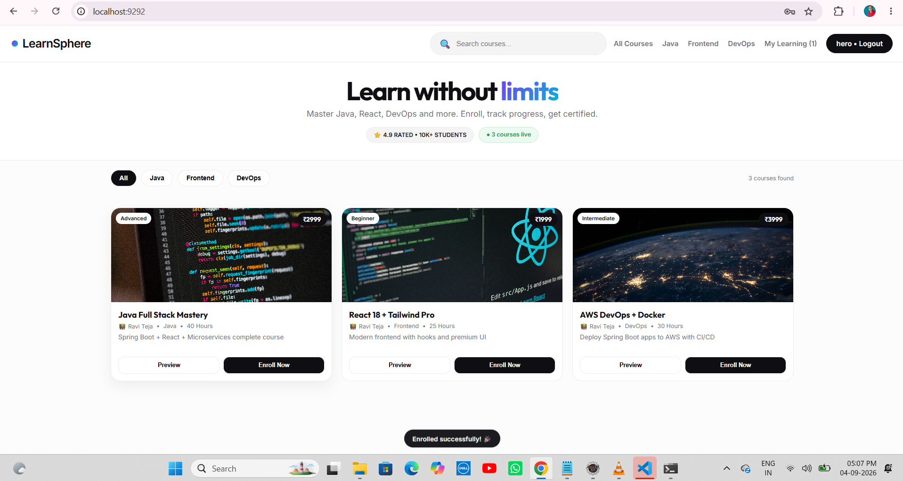

---

### 4. My Learning Drawer – 1 Courses • 15% Avg

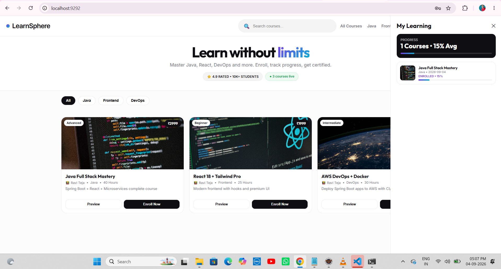

---

### 5. Filter Java – 1 Course Found

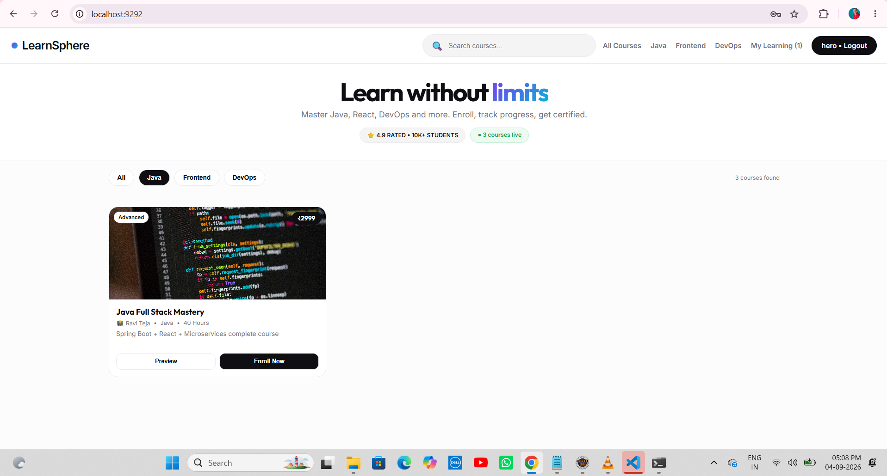

---

### 6. Filter Frontend – React Only

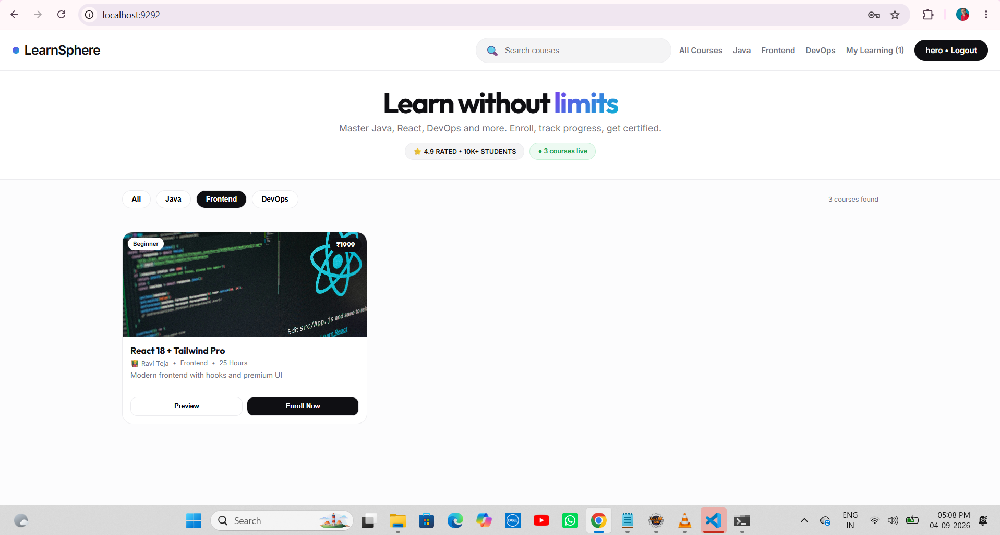

---

### 7. Filter DevOps – AWS Only

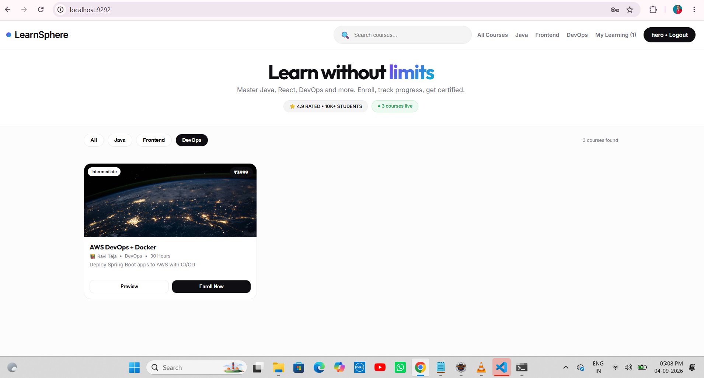

---

### 8. Instructor Account Creation

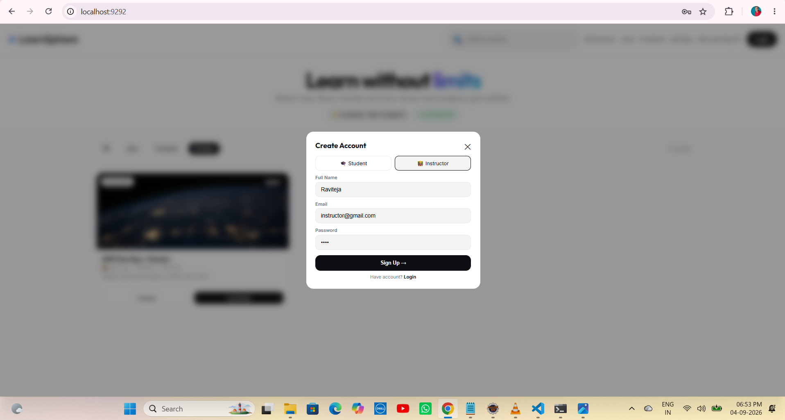

---

### 9. Instructor Login 

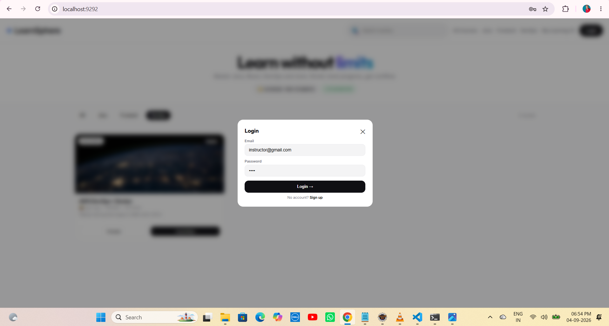

---

### 10. Instructor Dashboard

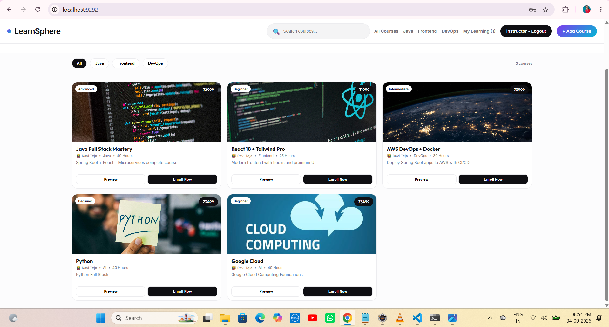

---

### 11. Adding Course By the Instructor

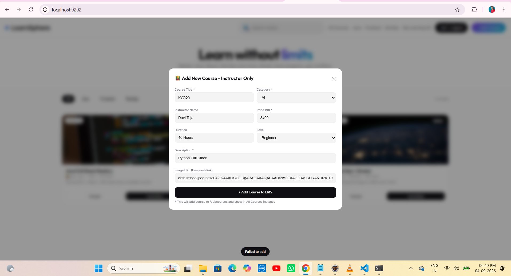

---

### 12. Adding One more Course By the Instructor

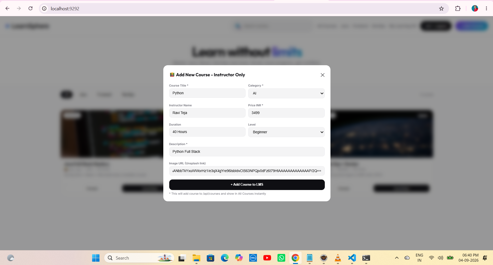

---

### 13. API /api/courses

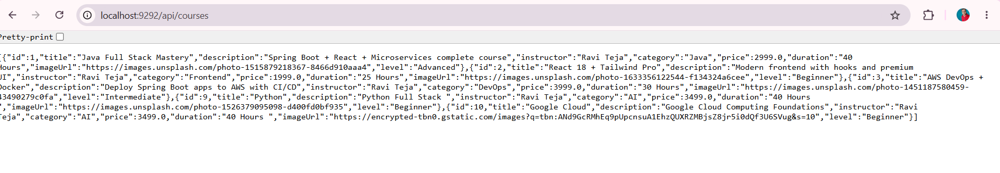

---

### 14. API/Enrollments

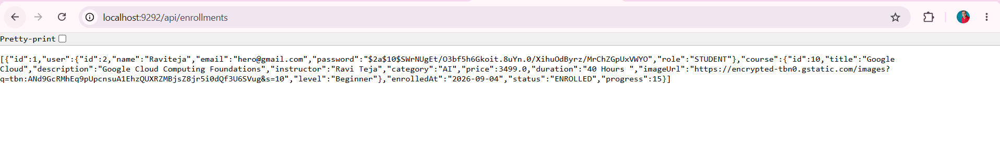

---

## 🎯 Learning Outcomes

- Bypass Full Stack – Single static/index.html served by Spring Boot on same port 9292 – Single JAR – No CORS – Real App not dummy
- H2 Database – mem vs file – create vs update – DataLoader sample courses – imageUrl length 2000 fix for base64 fail
- Security Bypass – permitAll() – Fast Tier 7
- Simple Token – Base64 email:role:timestamp – localStorage ls_user
- My Learning Feature – findByUser_Email custom query – ManyToOne – Drawer UI + Progress – 15% default – AVG calculation
- Role UI – if INSTRUCTOR shows + Add Course violet else hidden – if STUDENT shows Enroll Now – Toast protection Only STUDENT can enroll
- Real App UI – Outfit + Inter fonts – Gradient #7C3AED -> #06B6D4 + Dark #0F0F13 – Cards with price badge + level pill + hover shadow + Progress black card
- Enrollment FK fix – /api/users/by-email endpoint – user id mapping
- Toast UX – Black pills Enrolled successfully!, Course added!, Role toasts
- Filters + Search – category filter + live search contains – 3 courses found counter
- API verification – /api/courses and /api/enrollments
- Image URL bug fix – base64/data:image too long for VARCHAR(255) – Solution Unsplash short URL + @Column(length=2000)

## 🚀 Future Enhancements

- Add real JWT filter – Authorization Bearer – JJWT lib
- Switch H2 mem to file for persistence – ./data/lmsdb
- Switch H2 to MySQL/PostgreSQL – application-prod.properties
- Add course video player + lessons entity – OneToMany Course -> Lesson
- Add progress update – PUT /api/enrollments/{id}/progress – Complete button
- Add certificate generation after 100% – PDF
- Add rating + review entity
- Add pagination – Pageable – /api/courses?page=0&size=6
- Add wishlist – ManyToMany User <-> Course
- Deploy to Render/Railway – java -jar – Same port 9292
- Add React frontend later – 2 ports – 5173 + 9292
- Add S3 for course images instead of Unsplash URL

## 👨‍💻 Author

### Vemula Leela Venkata Ravi Teja

Java Full Stack Developer

100 Java Full Stack Projects Challenge

Project 69 / 100 – Bypass Track – LearnSphere Real App

Tier 7 – Full Stack Integration – Single Port 9292

### Test Accounts

- `hero@gmail.com` – STUDENT
- `instructor@gmail.com` – INSTRUCTOR

## ⭐ Support

If you found this project helpful, give it a ⭐ Star on GitHub!

### Repo

https://github.com/raviteja-dev950/69-lms-mini

### Run

```bash
mvn spring-boot:run
```

Open:

```text
http://localhost:9292/
```

Register STUDENT:

```text
hero@gmail.com -> Enroll Now -> My Learning (1) -> 15% Avg
```

Register INSTRUCTOR:

```text
instructor@gmail.com -> + Add Course -> Python 3499 -> Course added! -> 5 courses live
```

Sample Courses

Java Full Stack Mastery – ₹2999 – Advanced – 40 Hours – Spring Boot + React + Microservices

React 18 + Tailwind Pro – ₹1999 – Beginner – 25 Hours – Modern frontend with hooks

AWS DevOps + Docker – ₹3999 – Intermediate – 30 Hours – Deploy Spring Boot apps to AWS

Python + AI Mastery – ₹3499 – Beginner – 35 Hours – Python for AI (Added via Instructor UI)

Google Cloud Computing Foundations – ₹3499 – Beginner – 40 Hours – Cloud (Added via Instructor UI)
